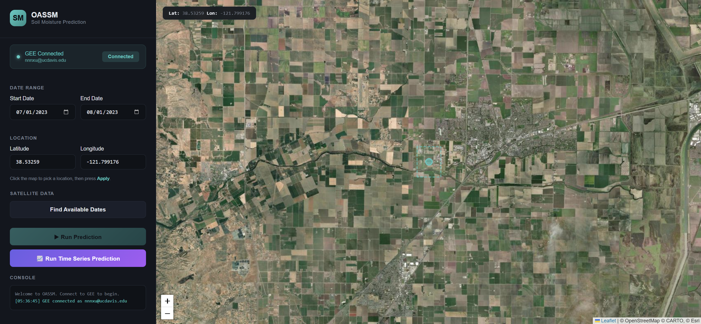
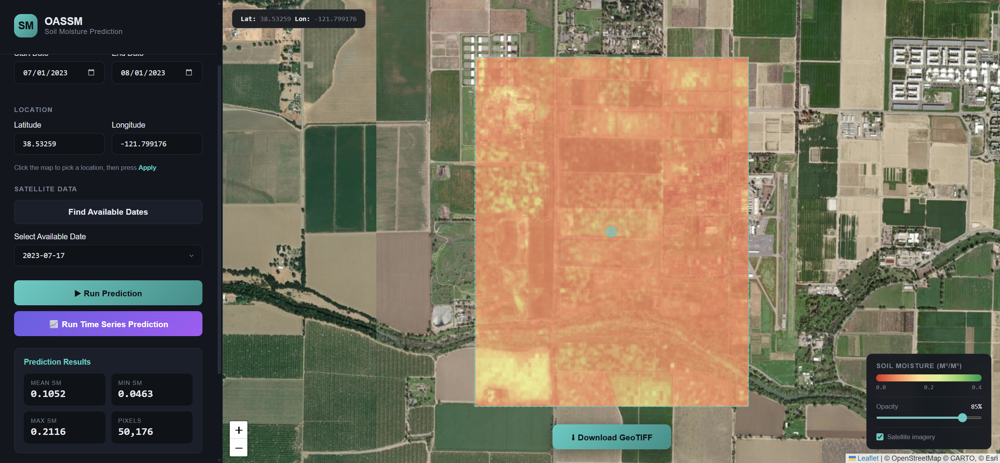
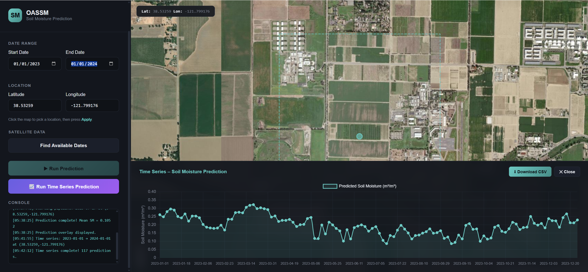

# On-demand AI-driven Surface Soil Moisture at 10 m (OASSM-10)

A deep-learning pipeline for **surface soil moisture (SSM) estimation** at 10 m resolution, powered by a modality-aware Transformer that fuses multi-source remote sensing data through cross-attention. The project includes model training, batch inference, and an interactive web tool for on-demand prediction.

---

## Overview

This project predicts volumetric soil moisture (m³/m³) by combining:

- **Sentinel-1** SAR backscatter (VV, VH)
- **Sentinel-2** multispectral imagery (Bands 2–8A, 11, 12)
- **Landsat 8/9** optical & thermal bands (Bands 2–7, 10)
- **Topographic features** derived from the Copernicus DEM (elevation, slope, TWI, aspect)
- **Ancillary context** including climate zone (Beck–Köppen–Geiger), USDA soil texture, and ESA WorldCover land-cover class

The core model is a modality-aware Transformer with the following design:

| Component | Description |
|---|---|
| **Modality-specific tokenizers** | Per-feature MLP projections with learnable scaling, grouped into SAR, optical-thermal, and temporal streams |
| **Shared dynamic encoder** | Pre-norm Transformer encoder with multi-head self-attention across all dynamic tokens |
| **Static context branch** | Categorical embeddings + quantile-transformed topographic features, projected into the same latent space |
| **Cross-attention fusion** | Static query attends to dynamic key/value tokens for information integration |
| **Training strategy** | 5-fold GroupKFold (by station), weighted Huber loss with cosine-annealed δ, quantile-based sample weighting for dry/wet tails, warmup + cosine LR schedule |

Ground-truth labels come from the **International Soil Moisture Network (ISMN)**.

---

## Repository Structure

```
.
├── training.ipynb                 # Model training (5-fold CV)
├── prediction.ipynb   # Batch inference pipeline (GEE → GeoTIFF)
├── requirements.txt               # Python dependencies
├── data/
│   ├── train_set.zip             # Training data (ISMN-matched pixels)
│   ├── test_se1.zip              # Hold-out test data
│   ├── label_encoders.pkl         # Fitted LabelEncoders for categorical features
│   └── cat_dims.pkl               # Category cardinalities
├── model/
│   ├── transformer_fold_{1..5}.pth   # Model checkpoints (state dict + metadata)
│   └── transformer_fold_{1..5}.pkl   # Fold-specific preprocessors (scalers)
├── images/
│   ├── webtool.png
│   ├── webtool1.png
│   └── webtool2.png
└── figures/                       # Output directory for SHAP plots
```

---

## Setup

### 1. Create environment & install dependencies

```bash
python -m venv .venv
source .venv/bin/activate   # Windows: .venv\Scripts\activate
pip install -r requirements.txt
```

> **Note:** The default `pip install torch` installs the CPU-only build. For GPU support, install PyTorch separately first:
> ```bash
> pip install torch --index-url https://download.pytorch.org/whl/cu121
> ```

### 2. Prepare data

Unzip the data archives in `./data/`:

```bash
cd data
unzip train_set1.zip
unzip test_set1.zip
```

Each `.pkl` file is a pandas DataFrame with pre-processed, station-matched samples. The columns include:

**Numeric features (32):**

| Group | Features |
|---|---|
| SAR | `angle`, `VV`, `VH`, `VH_minus_VV` |
| Sentinel-2 | `Sentinel2_B2` – `B8A`, `B11`, `B12` |
| Landsat | `Landsat_B2` – `B7`, `B10` |
| Spectral indices | `NDVI_Best`, `NDMI_Best` |
| Temporal / lag | `s2_lag`, `landsat_lag`, `Day_sin`, `Day_cos` |
| Topography | `DSM`, `Slope`, `TWI_proxy`, `Aspect_sin`, `Aspect_cos` |

**Categorical features (3):** `BeckKG_band1` (climate zone), `Soil_Texture_USDA`, `LandCover`

**Target:** `soil_moisture` (m³/m³), sourced from the ISMN.

---

## Usage Instructions

### 1. Train the Model

Open `training.ipynb` and run all cells sequentially. The notebook will:

1. Load and augment the training data (including urban sample synthesis)
2. Label-encode categorical features and save encoders to `./data/`
3. Run 5-fold GroupKFold cross-validation with station-level grouping
4. For each fold: fit modality-specific preprocessors (Yeo–Johnson for SAR/optical, RobustScaler for temporal, QuantileTransformer for static), train the Transformer with early stopping, and save the best checkpoint
5. Report OOF and test-set metrics (RMSE, ubRMSE, Bias, R²)
6. Save stacking-ready prediction CSVs

**Outputs** (saved to `./model/`):
- `transformer_fold_{1..5}.pth` — model weights + architecture metadata
- `transformer_fold_{1..5}.pkl` — fold-specific preprocessing pipelines

### 2. Feature Importance Analysis

Run the standalone script after training:

```bash
python feature_importance.py
```

This loads the 5 trained checkpoints (no retraining), computes SHAP values via `GradientExplainer` averaged across folds, and generates three publication-ready figures in `./figures/`: a beeswarm plot, a combined bar + beeswarm plot, and a color-coded bar chart grouped by physical modality.

Edit the paths at the top of the script (`MODEL_DIR`, `DATA_DIR`, etc.) to match your directory layout.

### 3. Batch Inference (Make Predictions)

The inference pipeline in `prediction.ipynb` produces spatially explicit soil moisture maps from raw satellite imagery. It relies on the **Google Earth Engine (GEE) Python API** for data acquisition.

**Install and authenticate GEE before running:**

```bash
pip install earthengine-api
earthengine authenticate
```

Follow the browser-based sign-in flow and paste the authorization token when prompted. For details, see the [GEE Python API introduction](https://developers.google.com/earth-engine/tutorials/community/intro-to-python-api).

The notebook proceeds through the following steps:

| Cell | Stage | Description |
|---|---|---|
| 0 | **GEE data acquisition** | Queries Sentinel-1 (same-day), Sentinel-2, Landsat 8/9 (closest within ±14 days), Copernicus DEM, ESA WorldCover, and USDA soil texture for the target ROI and date. Composites all bands into a single multi-band image and exports as GeoTIFF. |
| 1 | **GeoTIFF → DataFrame** | Reads the exported `.tif` with `rasterio`, reshapes the pixel grid into a tabular DataFrame with longitude/latitude coordinates. |
| 2–3 | **Feature engineering** | Computes temporal lag features (`s2_lag`, `landsat_lag`), day-of-year cyclical encodings (`Day_sin`, `Day_cos`), spectral indices (`NDVI_Best`, `NDMI_Best`), and applies best-source selection logic. |
| 4 | **Climate zone lookup** | Samples the Beck–Köppen–Geiger classification raster at each pixel location using `rasterio` with on-the-fly resampling to 10 m. |
| 5 | **Save processed data** | Exports the inference-ready DataFrame as `.pkl`. |
| 6 | **Standardization** | Loads the training-time standardizer (`standardizer.joblib`) and applies the same transformations to ensure feature distributions match training. |
| 7 | **Transformer ensemble inference** | Loads all 5 fold checkpoints, applies fold-specific preprocessing, runs batched forward passes, and averages predictions across folds. |
| 8 | **Export to GeoTIFF** | Pivots predictions back to a regular lat/lon grid and writes a georeferenced GeoTIFF (EPSG:4326) with `rasterio`. |

### 4. Web Tool

The interactive web tool provides a point-and-click interface for on-demand soil moisture prediction:

1. **Select location** — Click any point on the map or manually enter longitude/latitude coordinates.
2. **Check available dates** — Choose a start and end date, then click **"Check Available Dates"** to query Sentinel-1 overpasses.

   

3. **Run prediction** — Select a valid date from the returned list and click **"Run Prediction"**.

   

4. **Run time series prediction** — Click **"Run Time Series Prediction"** to perform long-term time series analysis for the selected coordinate point, allowing you to examine temporal variations in predicted soil moisture over an extended period.

   
---

## Key Dependencies

| Package | Purpose |
|---|---|
| `torch` | Model training & inference |
| `shap` | Gradient-based feature importance |
| `scikit-learn` | Preprocessing, cross-validation, metrics |
| `earthengine-api` | Satellite data acquisition via GEE |
| `rasterio` | GeoTIFF I/O |
| `pandas` / `numpy` | Data manipulation |
| `matplotlib` | Visualization |
| `joblib` | Serialization of preprocessors |
| `tqdm` | Progress bars |

See `requirements.txt` for pinned versions.

---

## Citation

If you use this code or model in your research, please cite the associated publication (forthcoming).

---

## License

This project is provided for academic and research purposes.
